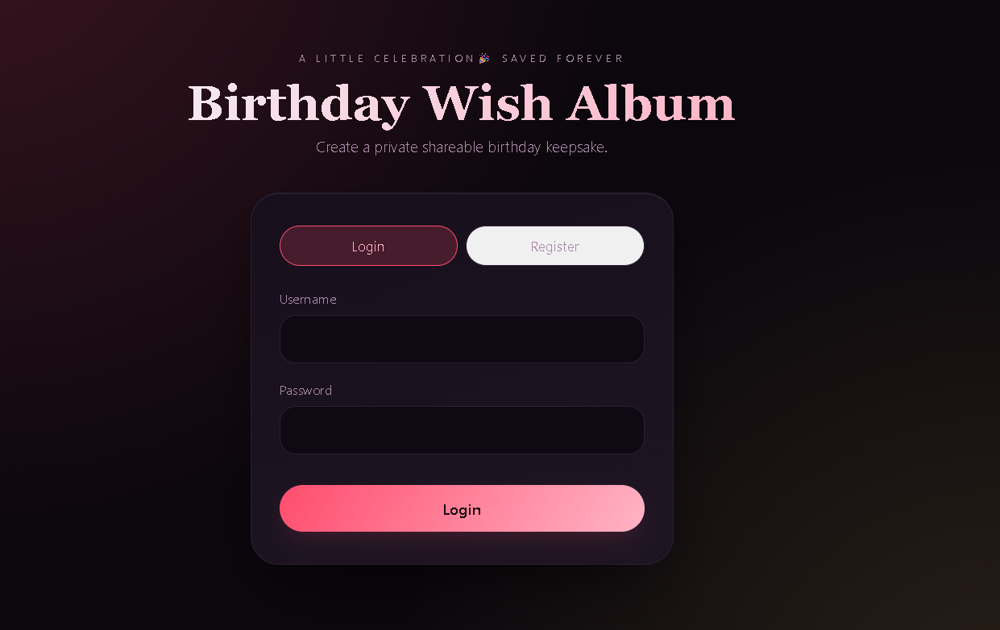
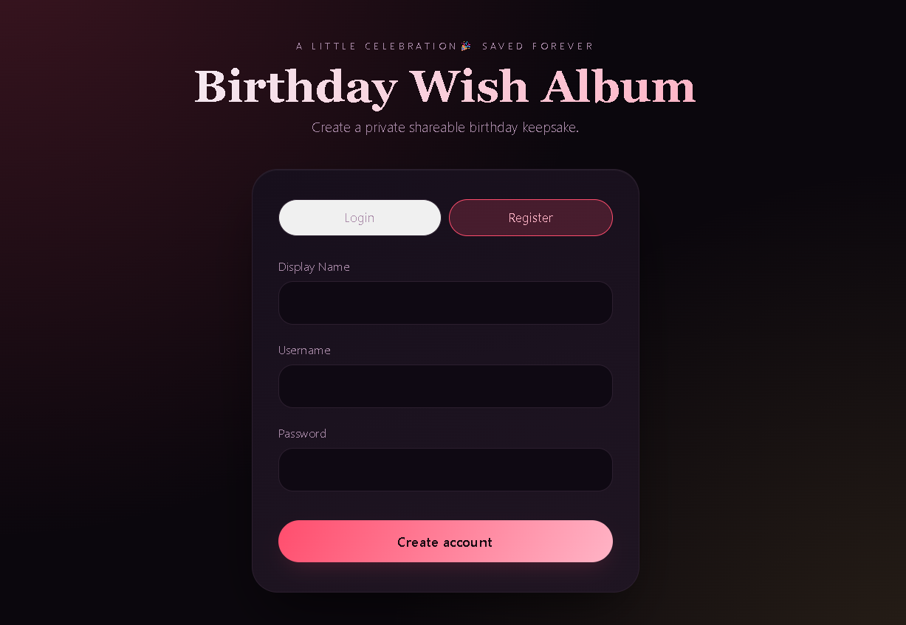

#  ***Birthday Wish Album 🎂***
<div align="center">
       
### 💖 ***Create. Personalize. Celebrate.***

***A private animated birthday album built with FastAPI, MongoDB Atlas, HTML, CSS & JavaScript***

***Photo • Birthday Wish • Music • Locket Animation • Cake • Confetti • Balloons • Shareable Album***
</div>

<p align="center">


</p>

<p align="center">

<a href="https://birthday-wisher-eokf.onrender.com" target="_blank">

</a>

</p>

<p align="center">

***Made with ❤️ by Ankit Gupta***

</p>

</div>

---

### ***🎂 About The Project***

**Birthday Wish Album** is a private and personalized web application designed to create beautiful digital birthday experiences for someone special.

Instead of sending a normal birthday message, the application lets you create an interactive birthday album containing:

* 📸 Personal photo
* 💌 Custom birthday wish
* 🎵 Personal songs
* 💖 Animated heart-shaped locket
* 🎂 Birthday cake interaction
* 🕯️ Candle-blowing animation
* 🎈 Floating balloons
* 🎉 Confetti effects
* ✨ Sparkles and floating hearts
* 🎨 Multiple pink-based themes
* 🔗 Shareable public album link

The application provides a complete flow:

```text
Register / Login
       ↓
Personal Dashboard
       ↓
Create Birthday Album
       ↓
Add Photo + Wish + Songs
       ↓
Choose Theme & Animations
       ↓
Save Album
       ↓
Generate Shareable Link
       ↓
Interactive Birthday Experience ❤️
```

---

###  ***Live Demo 🌐***

<p align="center">

<a href="https://birthday-wisher-eokf.onrender.com" target="_blank">


</a>

</p>

🌐 ***Live Application👉 [Birthday Wisher](https://birthday-wisher-eokf.onrender.com)***

---

### 📸 Project Showcase

### ***🏠 Login & Authentication***

The first screen allows the creator to securely register and log in before accessing their birthday albums.

<p align="center">


</p>

---

### ***🎨 Create Birthday Album***

The creator can customize every important part of the birthday experience.

* Recipient name
* Birthday date
* Birthday message
* Personal photo
* Songs
* Theme
* Animation preferences


---

### ***🔐 Secure Private Album Creation***

Each creator has their own authenticated account.

Only the album owner can:

* Create albums
* Edit albums
* Delete albums
* Upload media
* Manage album settings

The final album can then be shared using a public album URL.

---

### ***✨ Key Features***

### ***🔐 Authentication***

* User registration
* User login
* JWT-based authentication
* Password hashing
* 7-day session expiry
* Protected album management APIs
* Owner-based authorization

---

### ***🎂 Personalized Birthday Album***

Each album can contain:

```text
Recipient Name
       +
Birthday Date
       +
Custom Wish
       +
Personal Photo
       +
Songs
       +
Theme
       +
Animations
```

This makes every album unique.

---

### ***💖 Animated Heart Locket***

The signature interaction of the project is a heart-shaped locket.

```text
          💖
       ┌───────┐
       │       │
       │ PHOTO │
       │       │
       └───────┘
          ↓
       TAP / CLICK
          ↓
     💖 LOCKET OPENS
          ↓
       📸 PHOTO
```

The locket opens when the user interacts with it and reveals the recipient's photo.

---

### ***🎉 Celebration Animations***

The album supports multiple animations:

* 🎈 Floating balloons
* 💖 Floating hearts
* 🎊 Confetti
* ✨ Sparkles
* 🎂 Birthday cake
* 🕯️ Candle interaction
* 💫 Locket animation

Animations can be enabled or disabled from the album creation screen.

---

### ***🎨 Theme Variants***

Each album can have its own visual theme.

| Theme       | Description           |
| ----------- | --------------------- |
| 🌹 Rose     | Romantic pink/red     |
| 🌸 Blush    | Soft and elegant      |
| 💗 Magenta  | Vibrant pink          |
| 💜 Lavender | Purple-pink aesthetic |

Themes are controlled using CSS custom properties and the HTML `data-theme` attribute.

Example:

```html
<body data-theme="rose">
```

---

# 🎵 Music & Songs

The album supports personalized birthday music.

Users can:

### Upload Audio

Supported formats include:

```text
MP3
WAV
OGG
M4A
AAC
FLAC
```

### Fetch Public Audio

The creator can provide a direct public audio URL.

```text
Public MP3/WAV/OGG/M4A/AAC/FLAC URL
                  ↓
             Backend Fetch
                  ↓
          Store in MongoDB
                  ↓
          /api/media/{id}
                  ↓
             Album Player
```

Spotify and YouTube page URLs are intentionally rejected because they are not direct audio files.

---

# 🧠 Application Architecture

```text
                       ┌──────────────────────┐
                       │       Browser        │
                       │ HTML + CSS + JS      │
                       └──────────┬───────────┘
                                  │
                                  │ HTTP / REST API
                                  ▼
                       ┌──────────────────────┐
                       │       FastAPI        │
                       │      Backend         │
                       └──────────┬───────────┘
                                  │
              ┌───────────────────┼───────────────────┐
              │                   │                   │
              ▼                   ▼                   ▼
       ┌────────────┐      ┌────────────┐      ┌────────────┐
       │    JWT     │      │   Album    │      │   Media    │
       │    Auth    │      │   CRUD     │      │  Storage   │
       └────────────┘      └────────────┘      └────────────┘
                                  │
                                  ▼
                       ┌──────────────────────┐
                       │    MongoDB Atlas     │
                       │                      │
                       │ Users                │
                       │ Albums               │
                       │ Photos               │
                       │ Songs                │
                       └──────────────────────┘
```

---

### ***🏗️ Project Flow***

```text
                    ┌───────────────┐
                    │     User      │
                    └───────┬───────┘
                            │
                            ▼
                    ┌───────────────┐
                    │ Register/Login│
                    └───────┬───────┘
                            │
                            ▼
                    ┌───────────────┐
                    │   Dashboard   │
                    └───────┬───────┘
                            │
                     Create Album
                            │
                            ▼
              ┌─────────────────────────┐
              │ Album Configuration     │
              │                         │
              │ Name                    │
              │ Birthday                │
              │ Wish                    │
              │ Photo                   │
              │ Songs                   │
              │ Theme                   │
              │ Animations              │
              └────────────┬────────────┘
                           │
                           ▼
                  ┌─────────────────┐
                  │   MongoDB Atlas │
                  └────────┬────────┘
                           │
                           ▼
                  ┌─────────────────┐
                  │ Public Album URL│
                  └────────┬────────┘
                           │
                           ▼
                  🎂 Birthday Experience
```

---

### ***🛠️ Tech Stack***

✅ Frontend 👉 HTML | CSS | Fetch API | Animations.

✅ Backend 👉 Python 3.11 | FastAPI | Pydantic | JWT Auth.

✅ Database 👉 MongoDB Atlas Async | MongoDB driver | Document-based storage

✅ Deployment 👉 Docker |  Render
---

### ❤️*** Example User Journey***

```text
👤 Creator
   │
   ├── Register
   │
   ├── Login
   │
   └── Dashboard
          │
          └── Create New Album
                    │
                    ├── 👩 Recipient Name
                    ├── 📅 Birthday Date
                    ├── 💌 Birthday Wish
                    ├── 📸 Photo
                    ├── 🎵 Songs
                    ├── 🎨 Theme
                    └── ✨ Animations
                              │
                              ▼
                         💾 Save Album
                              │
                              ▼
                     🔗 Shareable Link
                              │
                              ▼
                     🎂 Birthday Album
                              │
               ┌──────────────┼──────────────┐
               ▼              ▼              ▼
             💖             🎵             🎉
           Locket          Music          Confetti
               │
               ▼
             🎂
        Birthday Celebration
```

---

### ***🌟 Why I Built This***

This project combines **web development, backend engineering, database management, authentication, media handling, animations and cloud deployment** into one complete application.

The goal was not simply to create another CRUD application.

The goal was to build something that feels **personal, interactive and memorable** while still demonstrating practical software engineering skills.
---

### ***⭐ Support***

If you like this project or find it useful for learning:

⭐ Star the repository
🍴 Fork the project
🐛 Report issues
💡 Suggest improvements

---

<div align="center">

### ***🎂 Birthday Wish Album***

### ***A little code. A little creativity. A lot of love. ❤️***

***Create a memory. Share a smile. Celebrate someone special.***

<br>

### 👨‍💻 ***ANKIT GUPTA***

***AI Engineer • Python Developer • AIML Enthusiast***

***Building intelligent and meaningful applications***

<br>

***Made with ❤️ using Python, FastAPI, MongoDB & JavaScript***

</div>

